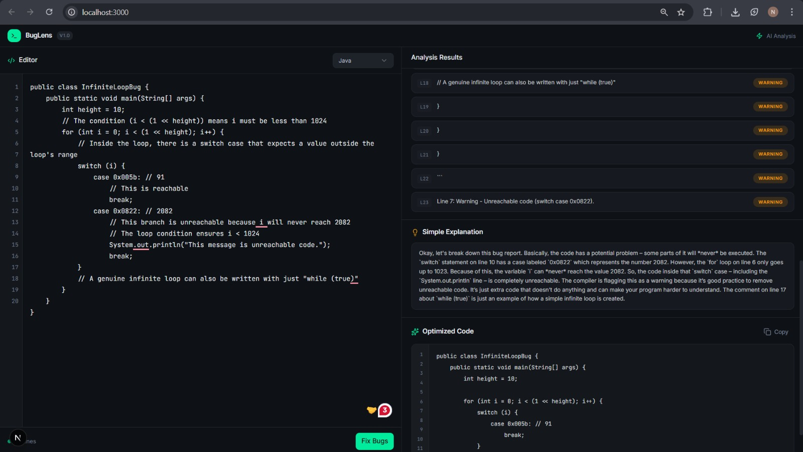

# BugLens 🔍

**BugLens** is an AI-powered code analysis tool designed to identify logical errors, explain complex bugs in plain English, and provide production-ready optimized code. Built with a sleek interface generated by **v0**, it leverages the latest **Google Gemma 3** models via **OpenRouter** to provide deep technical insights.

---

## ✨ Features

The application is split into a streamlined dual-pane editor and analysis suite:

 

* **Smart Editor**: A robust code input area supporting multiple languages (currently showing Java support).
* **Analysis Results**: Real-time bug detection powered by `gemma-3-12b-it`. It flags specific lines with warnings, such as unreachable code or infinite loops.
* **Simple Explanation**: A human-friendly breakdown of *why* the bug exists, powered by `gemma-3-4b-it`. It turns complex compiler warnings into understandable logic.
* **Optimized Code**: Instant generation of corrected, clean code using `gemma-3-12b-it`, ready to be copied back into your project.

---

## 🧠 The AI Engine

BugLens uses a tiered model approach through **OpenRouter** to balance speed and reasoning depth:

| Section | Model Used | Purpose |
| :--- | :--- | :--- |
| **Analysis** | `google/gemma-3-12b-it:free` | High-reasoning detection of logical flaws. |
| **Explanation** | `google/gemma-3-4b-it:free` | Lightweight, fast natural language processing. |
| **Optimization** | `google/gemma-3-12b-it:free` | Complex code synthesis and refactoring. |

---

## 🚀 Getting Started

### Prerequisites
* An [OpenRouter API Key](https://openrouter.ai/)
* Node.js & npm installed

### Installation

1.  **Clone the repository**:
    ```bash
    git clone [https://github.com/nivedharadha/ai-bug-detector.git](https://github.com/nivedharadha/ai-bug-detector.git)
    cd ai-bug-detector
    ```

2.  **Install dependencies**:
    ```bash
    npm install
    ```

3.  **Set up your Environment Variables**:
    Create a `.env` file in the root directory and add your key:
    ```env
    OPENROUTER_API_KEY=your_key_here
    ```

4.  **Run the development server**:
    ```bash
    npm run dev
    ```
    Open [http://localhost:3000](http://localhost:3000) to see the result.

---

## 🛠️ Built With

* **Frontend**: Next.js, Tailwind CSS (UI scaffolded by [v0.dev](https://v0.dev))
* **AI Orchestration**: OpenRouter SDK
* **LLMs**: Google Gemma 3 (12B and 4B)
